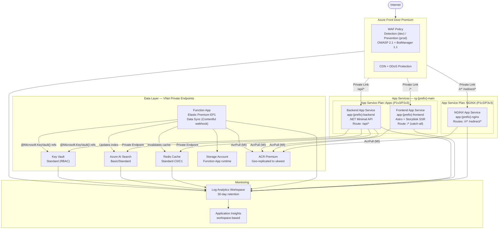
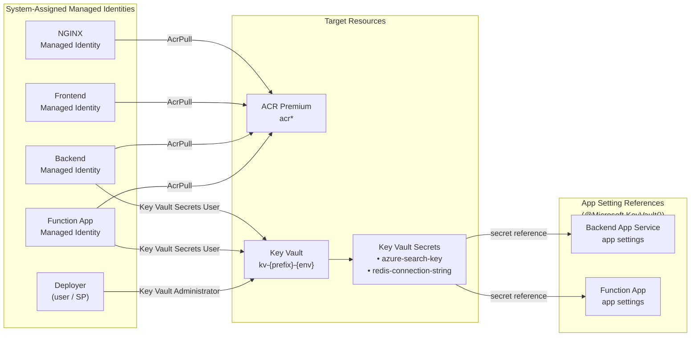

# Bootstrap Azure Infrastructure Bootstrap

Terraform bootstrap and CLI for the Bootstrap reference architecture:
Azure Front Door Premium, App Services (NGINX + Frontend + Backend), Redis, AI Search, Function App -- all private-networked via VNet + Private Endpoints.

---

## Architecture

All services sit behind private endpoints inside a VNet. No public endpoints are exposed.
Azure Front Door reaches App Services via Private Link (AFD Premium integration).

### Overview



### Network Topology

```mermaid
flowchart TD
    subgraph RG_NET["rg-{prefix}-networking"]
        subgraph VNet["VNet: vnet-{prefix}\n10.0.0.0/16 (dev)  |  10.1.0.0/16 (prod)"]

            subgraph SNET_APP["snet-{prefix}-app-services  10.x.1.0/24\nDelegated: Microsoft.Web/serverFarms"]
                NSG["NSG: nsg-{prefix}-app-services"]
                NGINX_PE["NGINX App Service\n(VNet-integrated)"]
                FE_PE["Frontend App Service\n(VNet-integrated)"]
                BE_PE["Backend App Service\n(VNet-integrated)"]
            end

            subgraph SNET_PE["snet-{prefix}-private-endpoints  10.x.2.0/24\nPrivate endpoint network policies: Disabled"]
                PE_NGINX["PE: App Service NGINX"]
                PE_FE["PE: App Service Frontend"]
                PE_BE["PE: App Service Backend"]
                PE_FUNC["PE: Function App"]
                PE_ACR["PE: ACR"]
                PE_REDIS["PE: Redis"]
                PE_SEARCH["PE: AI Search"]
                PE_KV["PE: Key Vault"]
                PE_BLOB["PE: Storage (blob)"]
                PE_QUEUE["PE: Storage (queue)"]
                PE_TABLE["PE: Storage (table)"]
                PE_FILE["PE: Storage (file)"]
            end

            subgraph SNET_FUNC["snet-{prefix}-functions  10.x.4.0/24\nDelegated: Microsoft.Web/serverFarms"]
                FUNC_APP["Function App\n(VNet-integrated)"]
            end

            subgraph SNET_DEVOPS["snet-{prefix}-devops-agents  10.x.3.0/24\n(Reserved for future use)"]
                DEVOPS["-- reserved --"]
            end
        end

        subgraph DNS["Private DNS Zones (linked to VNet)"]
            DNS1["privatelink.azurewebsites.net"]
            DNS2["privatelink.azurecr.io"]
            DNS3["privatelink.redis.cache.windows.net"]
            DNS4["privatelink.search.windows.net"]
            DNS5["privatelink.blob.core.windows.net"]
            DNS6["privatelink.queue.core.windows.net"]
            DNS7["privatelink.table.core.windows.net"]
            DNS8["privatelink.file.core.windows.net"]
            DNS9["privatelink.vaultcore.azure.net"]
        end
    end

    subgraph RG_MAIN["rg-{prefix}-main  (services)"]
        AFD_SVC["Azure Front Door Premium"]
        NGINX_SVC["NGINX App Service"]
        FE_SVC["Frontend App Service"]
        BE_SVC["Backend App Service"]
        FUNC_SVC["Function App"]
        ACR_SVC["ACR Premium"]
        REDIS_SVC["Redis Cache"]
        SEARCH_SVC["AI Search"]
        KV_SVC["Key Vault"]
        ST_SVC["Storage Account"]
    end

    NSG -- "AllowHTTPS from AzureFrontDoor.Backend\nAllowVNetInbound\nAllowAzureLoadBalancer\nDenyDirectInternet" --> SNET_APP

    AFD_SVC -- "Private Link (AFD Premium)" --> PE_NGINX & PE_FE & PE_BE

    PE_NGINX --> NGINX_SVC
    PE_FE --> FE_SVC
    PE_BE --> BE_SVC
    PE_FUNC --> FUNC_SVC
    PE_ACR --> ACR_SVC
    PE_REDIS --> REDIS_SVC
    PE_SEARCH --> SEARCH_SVC
    PE_KV --> KV_SVC
    PE_BLOB & PE_QUEUE & PE_TABLE & PE_FILE --> ST_SVC
```



### Identity & Access (RBAC)



---

## Module Architecture

The Terraform codebase is built on **standardised, reusable building-block modules** that bake in best practices as defaults. Service modules compose these building blocks, and the root module wires everything together. This design means AI-assisted infrastructure changes operate at the composition level rather than freestyling raw provider syntax.

### Building Blocks

| Module | Purpose | Baked-in Defaults |
|--------|---------|-------------------|
| `private_endpoint` | Private Link + DNS registration | Automatic DNS zone group, standardised naming |
| `diagnostic_setting` | Log Analytics diagnostic shipping | AllMetrics enabled by default |
| `linux_web_app` | Opinionated App Service | HTTPS-only, always-on, VNet route-all, Front Door IP restriction, ACR pull via managed identity, private endpoint, App Insights |

### Service Modules

| Module | Composes | Purpose |
|--------|----------|---------|
| `networking` | — | VNet, subnets, NSGs, Private DNS Zones |
| `container_registry` | `private_endpoint` | ACR Premium + geo-replication |
| `redis` | `private_endpoint` | Redis Cache with security defaults |
| `search` | `private_endpoint` | Azure AI Search |
| `key_vault` | `private_endpoint` | Key Vault (RBAC-enabled) |
| `function_app` | `private_endpoint` (×5) | Data Sync Function App + storage |
| `front_door` | — | AFD Premium, WAF, CDN, routes, custom domains |
| `monitoring` | `diagnostic_setting` (×N) | Log Analytics + App Insights + all diagnostics |

### Adding a New Web App

To add a new service, add a single module call in `main.tf`:

```hcl
module "my_new_service" {
  source = "./modules/linux_web_app"

  prefix              = local.prefix
  name                = "my-service"
  suffix              = local.suffix
  location            = var.location
  resource_group_name = azurerm_resource_group.main.name
  service_plan_id     = azurerm_service_plan.apps.id
  docker_image        = "my-service:latest"
  acr_login_server    = module.container_registry.login_server
  acr_id              = module.container_registry.id
  vnet_integration_subnet_id = module.networking.subnet_ids["app_services"]
  private_endpoint_subnet_id = module.networking.subnet_ids["private_endpoints"]
  private_dns_zone_ids       = module.networking.private_dns_zone_ids["app_service"]
  front_door_id              = azurerm_cdn_frontdoor_profile.main.resource_guid
  application_insights_connection_string = module.monitoring.application_insights_connection_string
  tags                = local.common_tags

  extra_app_settings = {
    MY_CUSTOM_VAR = "value"
  }
}
```

The module handles HTTPS enforcement, VNet integration, Front Door IP restrictions, ACR pull permissions, private endpoint creation, DNS registration, and App Insights — no boilerplate needed.

---

## What Gets Created

| Resource | Name Pattern | SKU (dev / prod) | Purpose |
|----------|-------------|-------------------|---------|
| Resource Groups | `rg-bootstrap-{env}-main`, `-networking` | -- | Resource organisation |
| Virtual Network | `vnet-bootstrap-{env}` | -- | Private networking for all services |
| Subnets (x4) | `snet-bootstrap-{env}-*` | -- | App Services, Private Endpoints, Functions |
| NSGs | `nsg-bootstrap-{env}-app-services` | -- | Allow AFD + VNet only, deny internet |
| Private DNS Zones | `privatelink.*.net` | -- | DNS resolution for private endpoints |
| Azure Front Door | `afd-bootstrap-{env}` | Premium | Global load balancing, WAF, CDN, TLS |
| WAF Policy | `waf*policy` | Detection / Prevention | OWASP + Bot protection |
| App Service Plan (NGINX) | `asp-bootstrap-{env}-nginx` | P1v3 / P3v3 | Dedicated plan for redirect workload |
| App Service Plan (apps) | `asp-bootstrap-{env}-apps` | P1v3 / P2v3 | Shared plan for frontend + backend |
| Web App (NGINX) | `app-bootstrap-{env}-nginx-*` | -- | High-volume redirects and routing rules |
| Web App (Frontend) | `app-bootstrap-{env}-frontend-*` | -- | Astro + Storyblok SSR application |
| Web App (Backend) | `app-bootstrap-{env}-backend-*` | -- | .NET minimal API with Fusion Cache |
| Container Registry | `acr*` | Premium | Docker images with geo-replication |
| Function App | `func-bootstrap-{env}-datasync-*` | Elastic Premium EP1 | Data synchronisation between systems |
| Storage Account | `st*fn*` | Standard LRS | Function App runtime storage |
| Redis Cache | `redis-bootstrap-{env}` | Standard C0 / C1 | Application caching |
| AI Search | `srch-bootstrap-{env}` | Basic / Standard | Full-text search |
| Key Vault | `kv-bootstrap-{env}` | Standard | Secrets management (RBAC-enabled) |
| Log Analytics | `law-bootstrap-{env}` | PerGB2018 | Centralised logging and diagnostics |

---

## Prerequisites

| Tool | Version | Install |
|------|---------|---------|
| [Terraform](https://developer.hashicorp.com/terraform/install) | >= 1.14 | `brew install terraform` |
| [Azure CLI](https://learn.microsoft.com/en-us/cli/azure/install-azure-cli) | >= 2.55 | `brew install azure-cli` |
| [Infracost](https://www.infracost.io/docs/) | >= 0.10 | Optional -- cost estimation |

Docker is **not** required. Container builds run remotely via ACR Tasks.

### Required Azure Permissions

The deploying identity (user or service principal) needs these roles on the target subscription:

| Role | Why |
|------|-----|
| **Owner** (or Contributor + User Access Administrator) | Create resources and assign RBAC roles (ACR Pull, Key Vault) |
| **Key Vault Administrator** | Auto-assigned by Terraform on the Key Vault for secret management |

---

## Project Structure

```
bootstrap-bootstrap/
├── apps/
│   └── frontend/                    # Astro + React + Storyblok frontend
│       ├── src/
│       │   ├── layouts/             # Base HTML layout
│       │   ├── pages/               # Catch-all slug route + /health endpoint
│       │   └── storyblok/           # Component mappings (Page, Hero, RichText, Image)
│       ├── Dockerfile               # Multi-stage build for ACR
│       └── package.json
│
├── cli/
│   └── infra                        # Unified CLI for all operations
│
└── terraform/
    ├── providers.tf                 # AzureRM v4 + AzureAD provider config
    ├── variables.tf                 # All input variables
    ├── main.tf                      # Root module — composes all modules
    ├── outputs.tf                   # Root outputs (URLs, endpoints)
    │
    ├── modules/
    │   │
    │   │── # ── Building Blocks (reusable primitives) ──────────
    │   ├── private_endpoint/        # Private Link + DNS (used by all service modules)
    │   ├── diagnostic_setting/      # Log Analytics diagnostic shipping
    │   ├── linux_web_app/           # Opinionated App Service with all defaults baked in
    │   │
    │   │── # ── Service Modules (compose building blocks) ──────
    │   ├── networking/              # VNet, subnets, NSGs, Private DNS Zones
    │   ├── front_door/              # AFD Premium, WAF, CDN, routes, custom domains
    │   ├── container_registry/      # ACR Premium + geo-replication
    │   ├── function_app/            # Data Sync Function App (Elastic Premium)
    │   ├── search/                  # Azure AI Search
    │   ├── redis/                   # Azure Redis Cache
    │   ├── key_vault/               # Key Vault (RBAC-enabled)
    │   └── monitoring/              # Log Analytics + App Insights + diagnostics
    │
    └── environments/
        ├── dev/
        │   ├── terraform.tfvars     # Dev-sized SKUs, WAF in Detection mode
        │   └── backend.hcl          # Remote state backend pointer
        └── prod/
            ├── terraform.tfvars     # Production SKUs, WAF in Prevention mode
            └── backend.hcl
```

---

## First-time Setup (per client tenant)

### 1. Authenticate

```bash
./cli/infra login dev
```

### 2. Create remote state backend

Creates a Storage Account (GRS, soft delete, resource lock) to hold `.tfstate` files.

```bash
./cli/infra bootstrap dev <subscription-id>
```

### 3. Update variables

Edit `terraform/environments/dev/terraform.tfvars`:

```hcl
subscription_id = "<client-subscription-id>"
tenant_id       = "<client-tenant-id>"
```

### 4. Initialise Terraform

```bash
./cli/infra init dev
```

### 5. Plan

```bash
./cli/infra plan dev
```

Review the plan output carefully, especially:
- Private DNS Zone names (must not conflict with existing zones in the subscription)
- Subnet address spaces (must not overlap with existing VNets if peered)
- AFD WAF mode (`Detection` in dev, `Prevention` in prod)

### 6. Apply

```bash
./cli/infra apply dev
```

### 7. Set Storyblok credentials

Storyblok secrets are managed outside of Terraform to avoid storing them in state:

```bash
./cli/infra secrets:set dev
```

---

## Day-to-day Operations

### Build and push a container image

Builds run remotely via ACR Tasks -- no local Docker needed:

```bash
./cli/infra acr:build dev frontend:v1.2.3 ./apps/frontend
./cli/infra acr:build dev backend-api:v2.0.0 ./apps/backend
```

### Stream live logs from an App Service

```bash
./cli/infra app:logs dev frontend
./cli/infra app:logs dev backend
./cli/infra app:logs dev nginx
```

### Purge CDN cache after a deployment

```bash
./cli/infra afd:purge dev /
./cli/infra afd:purge prod /static/*
```

### Rotate Redis credentials

```bash
./cli/infra secrets:rotate-redis prod
```

This regenerates the Redis primary key and updates the Key Vault secret, backend App Service connection string, and Function App app setting automatically.

### Get a cost estimate

```bash
./cli/infra cost dev
./cli/infra cost prod
```

---

## Promoting dev to prod

Prod uses a different subscription, higher SKUs, WAF in Prevention mode, and requires custom domain DNS validation.

**Before your first prod deploy:**

1. Copy and edit `terraform/environments/prod/terraform.tfvars`:
   ```hcl
   subscription_id = "<prod-subscription-id>"
   tenant_id       = "<prod-tenant-id>"
   custom_domains  = ["www.yourdomain.com", "api.yourdomain.com"]
   ```

2. Create the prod state backend:
   ```bash
   ./cli/infra bootstrap prod <prod-subscription-id>
   ```

3. Initialise, plan, and apply:
   ```bash
   ./cli/infra init prod
   ./cli/infra plan prod    # Review carefully -- prod uses Prevention WAF mode
   ./cli/infra apply prod
   ```

4. After apply, create CNAME records pointing your custom domains to the Front Door endpoint. AFD will automatically provision TLS certificates once DNS validation passes.

5. Set prod secrets:
   ```bash
   ./cli/infra secrets:set prod
   ```

---

## Key Design Decisions

### Standardised module architecture
All Terraform is built on reusable building-block modules (`private_endpoint`, `diagnostic_setting`, `linux_web_app`) that bake in production best practices as non-negotiable defaults. Service modules compose these building blocks, and the root module wires them together. This means adding new services requires only a short module call — the module handles security, networking, monitoring, and naming automatically.

### Network topology
All App Services, Functions, Redis, Search, and ACR are accessed exclusively via Private Endpoints inside the VNet. Azure Front Door reaches App Services via the AFD Premium Private Link integration.

### Managed identity
All App Services and the Function App use System-assigned Managed Identity to pull images from ACR. No ACR admin credentials are used or stored. Key Vault uses Azure RBAC (not access policies) for authorization.

### Storyblok CMS
Storyblok is externally hosted. The Frontend App Service accesses it over the internet (outbound via VNet). Credentials are stored in App Settings (set via `infra secrets:set`) and never in Terraform state or source control.

### Certificates
TLS is terminated at Azure Front Door. Certificates are managed by AFD with auto-renewal. For custom domains, AFD handles DigiCert issuance automatically once CNAME validation passes.

### State locking
The Azure Blob Storage backend provides automatic lease-based state locking. No additional configuration is needed -- concurrent `terraform apply` runs will wait or fail safely.

### Stateful resource protection
Redis, AI Search, and Key Vault have `lifecycle { prevent_destroy = true }` to guard against accidental deletion. To intentionally destroy these, you must first remove the lifecycle block.

---

## Sensitive Variables

**Never commit secrets to source control.** The prod `terraform.tfvars` is gitignored.

| Variable | How to set |
|----------|-----------|
| `subscription_id` / `tenant_id` | Edit `terraform.tfvars` per environment |
| Storyblok API token | `./cli/infra secrets:set <env>` (interactive) |
| Redis connection string | Auto-managed by `./cli/infra secrets:rotate-redis` |

---

## Destroying an environment

```bash
./cli/infra destroy dev
```

You will be asked to type the environment name to confirm.

**Note:** The resource group `rg-bootstrap-tfstate` (Terraform state) is not destroyed. To clean up completely:
```bash
# Remove the resource lock first
az lock delete --name DoNotDelete-tfstate --resource-group rg-bootstrap-tfstate
# Then delete the resource group
az group delete --name rg-bootstrap-tfstate --yes
```

---

## Troubleshooting

**`Error: A resource with the ID already exists`**
Import the existing resource: `./cli/infra state:import <env> <tf-addr> <azure-id>`

**Private endpoint DNS not resolving**
Check Private DNS Zone links: ensure the VNet link exists for `privatelink.azurewebsites.net`

**App Service can't pull image from ACR**
Confirm Managed Identity has `AcrPull` role: `az role assignment list --assignee <principal-id>`

**AFD returns 503 to origins**
Check origin health: `./cli/infra afd:origins <env>` -- App Services must allow AFD backend IPs via service tag `AzureFrontDoor.Backend`

**Key Vault access denied (403)**
The Key Vault uses Azure RBAC. Ensure the calling identity has the `Key Vault Secrets User` role (or `Key Vault Administrator` for write operations).

**`lifecycle { prevent_destroy }` blocking destroy**
Redis, Search, and Key Vault are protected. To destroy, temporarily comment out the lifecycle block in the relevant module, run `terraform plan`, then `terraform apply`.
