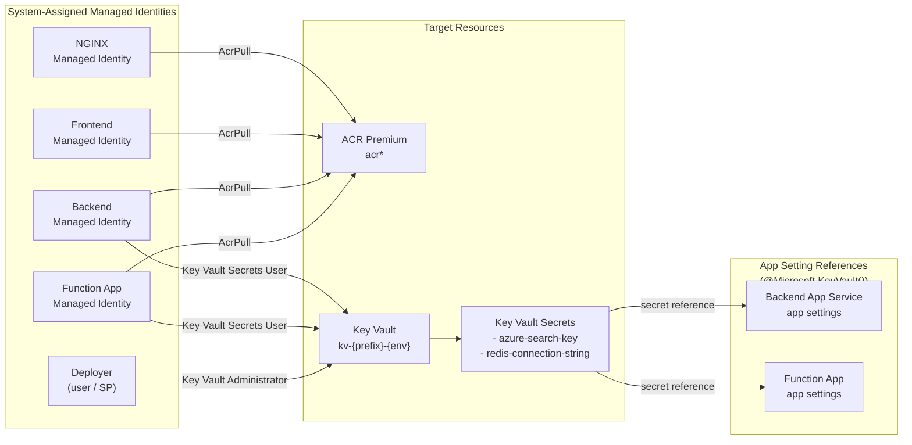

# Bootstrap

Terraform infrastructure-as-code for the reference architecture on Azure: Front Door Premium, App Services (NGINX + Frontend + Backend), Redis, AI Search, Function App — all private-networked via VNet and Private Endpoints.

---

## Architecture

All services sit behind private endpoints inside a VNet. No public endpoints are exposed. Azure Front Door reaches App Services via Private Link (AFD Premium integration).

### Overview


### Network Topology

```mermaid
flowchart TD
    subgraph RG_NET["rg-{prefix}-networking"]
        subgraph VNet["VNet: vnet-{prefix}\n10.0.0.0/16 (dev)  |  10.1.0.0/16 (prod)"]

            subgraph SNET_APP["snet-{prefix}-app-services  10.x.1.0/24\nDelegated: Microsoft.Web/serverFarms"]
                NSG["NSG: nsg-{prefix}-app-services"]
                NGINX_PE["NGINX App Service\n(VNet-integrated)"]
                FE_PE["Frontend App Service\n(VNet-integrated)"]
                BE_PE["Backend App Service\n(VNet-integrated)"]
            end

            subgraph SNET_PE["snet-{prefix}-private-endpoints  10.x.2.0/24\nPrivate endpoint network policies: Disabled"]
                PE_NGINX["PE: App Service NGINX"]
                PE_FE["PE: App Service Frontend"]
                PE_BE["PE: App Service Backend"]
                PE_FUNC["PE: Function App"]
                PE_ACR["PE: ACR"]
                PE_REDIS["PE: Redis"]
                PE_SEARCH["PE: AI Search"]
                PE_KV["PE: Key Vault"]
                PE_BLOB["PE: Storage (blob)"]
                PE_QUEUE["PE: Storage (queue)"]
                PE_TABLE["PE: Storage (table)"]
                PE_FILE["PE: Storage (file)"]
            end

            subgraph SNET_FUNC["snet-{prefix}-functions  10.x.4.0/24\nDelegated: Microsoft.Web/serverFarms"]
                FUNC_APP["Function App\n(VNet-integrated)"]
            end

            subgraph SNET_DEVOPS["snet-{prefix}-devops-agents  10.x.3.0/24\n(Reserved for future use)"]
                DEVOPS["-- reserved --"]
            end
        end

        subgraph DNS["Private DNS Zones (linked to VNet)"]
            DNS1["privatelink.azurewebsites.net"]
            DNS2["privatelink.azurecr.io"]
            DNS3["privatelink.redis.cache.windows.net"]
            DNS4["privatelink.search.windows.net"]
            DNS5["privatelink.blob.core.windows.net"]
            DNS6["privatelink.queue.core.windows.net"]
            DNS7["privatelink.table.core.windows.net"]
            DNS8["privatelink.file.core.windows.net"]
            DNS9["privatelink.vaultcore.azure.net"]
        end
    end

    subgraph RG_MAIN["rg-{prefix}-main  (services)"]
        AFD_SVC["Azure Front Door Premium"]
        NGINX_SVC["NGINX App Service"]
        FE_SVC["Frontend App Service"]
        BE_SVC["Backend App Service"]
        FUNC_SVC["Function App"]
        ACR_SVC["ACR Premium"]
        REDIS_SVC["Redis Cache"]
        SEARCH_SVC["AI Search"]
        KV_SVC["Key Vault"]
        ST_SVC["Storage Account"]
    end

    NSG -- "AllowHTTPS from AzureFrontDoor.Backend\nAllowVNetInbound\nAllowAzureLoadBalancer\nDenyDirectInternet" --> SNET_APP

    AFD_SVC -- "Private Link (AFD Premium)" --> PE_NGINX & PE_FE & PE_BE

    PE_NGINX --> NGINX_SVC
    PE_FE --> FE_SVC
    PE_BE --> BE_SVC
    PE_FUNC --> FUNC_SVC
    PE_ACR --> ACR_SVC
    PE_REDIS --> REDIS_SVC
    PE_SEARCH --> SEARCH_SVC
    PE_KV --> KV_SVC
    PE_BLOB & PE_QUEUE & PE_TABLE & PE_FILE --> ST_SVC
```



### Identity & Access (RBAC)



---

## Module Architecture

The Terraform codebase uses standardised, reusable building-block modules with production best practices baked in as defaults. Service modules compose these building blocks. The root module wires everything together.

### Building Blocks

| Module | Purpose | Defaults |
|--------|---------|----------|
| `private_endpoint` | Private Link + DNS registration | Automatic DNS zone group, standardised naming |
| `diagnostic_setting` | Log Analytics diagnostic shipping | AllMetrics enabled |
| `linux_web_app` | Opinionated App Service | HTTPS-only, TLS 1.2+, FTPS disabled, always-on, default-deny IP restrictions (Front Door only), SCM/Kudu locked down, VNet route-all, ACR pull via managed identity, private endpoint, App Insights |

### Service Modules

| Module | Composes | Purpose |
|--------|----------|---------|
| `networking` | -- | VNet, subnets, NSGs, Private DNS Zones |
| `container_registry` | `private_endpoint` | ACR Premium + geo-replication |
| `redis` | `private_endpoint` | Redis Cache |
| `search` | `private_endpoint` | Azure AI Search |
| `key_vault` | `private_endpoint` | Key Vault (RBAC-enabled) |
| `function_app` | `private_endpoint` (x5) | Data Sync Function App + storage |
| `front_door` | -- | AFD Premium, WAF, CDN, routes, custom domains |
| `monitoring` | `diagnostic_setting` (xN) | Log Analytics + App Insights + all diagnostics |

### Adding a New Web App

Add a single module call in `main.tf`:

```hcl
module "my_new_service" {
  source = "./modules/linux_web_app"

  prefix              = local.prefix
  name                = "my-service"
  suffix              = local.suffix
  location            = var.location
  resource_group_name = azurerm_resource_group.main.name
  service_plan_id     = azurerm_service_plan.apps.id
  docker_image        = "my-service:latest"
  acr_login_server    = module.container_registry.login_server
  acr_id              = module.container_registry.id
  vnet_integration_subnet_id = module.networking.subnet_ids["app_services"]
  private_endpoint_subnet_id = module.networking.subnet_ids["private_endpoints"]
  private_dns_zone_ids       = module.networking.private_dns_zone_ids["app_service"]
  front_door_id              = azurerm_cdn_frontdoor_profile.main.resource_guid
  application_insights_connection_string = module.monitoring.application_insights_connection_string
  tags                = local.common_tags

  extra_app_settings = {
    MY_CUSTOM_VAR = "value"
  }
}
```

The module handles HTTPS enforcement, TLS, VNet integration, Front Door IP restrictions, ACR pull permissions, private endpoint creation, DNS registration, and App Insights automatically.

---

## What Gets Created

| Resource | Name Pattern | SKU (dev / prod) | Purpose |
|----------|-------------|-------------------|---------|
| Resource Groups | `rg-{project}-{env}-main`, `-networking` | -- | Resource organisation |
| Virtual Network | `vnet-{project}-{env}` | -- | Private networking |
| Subnets (x4) | `snet-{project}-{env}-*` | -- | App Services, Private Endpoints, Functions, DevOps |
| NSGs | `nsg-{project}-{env}-app-services` | -- | Allow AFD + VNet only, deny internet |
| Private DNS Zones | `privatelink.*.net` | -- | DNS resolution for private endpoints |
| Azure Front Door | `afd-{project}-{env}` | Premium | Global load balancing, WAF, CDN, TLS |
| WAF Policy | `waf*policy` | Detection / Prevention | OWASP + Bot protection |
| App Service Plan (NGINX) | `asp-{project}-{env}-nginx` | P1v3 / P3v3 | Dedicated plan for redirect workload |
| App Service Plan (Apps) | `asp-{project}-{env}-apps` | P1v3 / P2v3 | Shared plan for frontend + backend |
| Web App (NGINX) | `app-{project}-{env}-nginx-*` | -- | Redirects and routing rules |
| Web App (Frontend) | `app-{project}-{env}-frontend-*` | -- | Astro + Storyblok SSR |
| Web App (Backend) | `app-{project}-{env}-backend-*` | -- | .NET minimal API |
| Container Registry | `acr*` | Premium | Docker images with geo-replication |
| Function App | `func-{project}-{env}-datasync-*` | Elastic Premium EP1 | Data synchronisation |
| Storage Account | `st*fn*` | Standard LRS | Function App runtime storage |
| Redis Cache | `redis-{project}-{env}` | Standard C0 / C1 | Application caching |
| AI Search | `srch-{project}-{env}` | Basic / Standard | Full-text search |
| Key Vault | `kv-{project}-{env}` | Standard | Secrets management (RBAC) |
| Log Analytics | `law-{project}-{env}` | PerGB2018 | Centralised logging and diagnostics |
| Application Insights | `appi-{project}-{env}` | -- | APM (workspace-based) |

---

## Project Structure

```
bootstrap/
├── apps/
│   └── frontend/                    # Astro + React + Storyblok frontend
│       ├── src/
│       │   ├── layouts/             # Base HTML layout
│       │   ├── pages/               # Catch-all slug route + /health endpoint
│       │   └── storyblok/           # Component mappings (Page, Hero, RichText, Image)
│       ├── Dockerfile               # Multi-stage build for ACR
│       └── package.json
│
└── terraform/
    ├── providers.tf                 # AzureRM v4 + AzureAD provider config
    ├── variables.tf                 # Input variables (with validations)
    ├── main.tf                      # Root module — composes all modules
    ├── outputs.tf                   # Root outputs (URLs, endpoints)
    ├── moved.tf                     # State migration blocks
    │
    ├── modules/
    │   ├── private_endpoint/        # Building block: Private Link + DNS
    │   ├── diagnostic_setting/      # Building block: Log Analytics shipping
    │   ├── linux_web_app/           # Building block: Opinionated App Service
    │   ├── networking/              # VNet, subnets, NSGs, Private DNS Zones
    │   ├── front_door/              # AFD Premium, WAF, CDN, routes
    │   ├── container_registry/      # ACR Premium + geo-replication
    │   ├── function_app/            # Data Sync Function App
    │   ├── search/                  # Azure AI Search
    │   ├── redis/                   # Azure Redis Cache
    │   ├── key_vault/               # Key Vault (RBAC)
    │   └── monitoring/              # Log Analytics + App Insights + diagnostics
    │
    └── environments/
        ├── dev/
        │   ├── terraform.tfvars     # Dev SKUs, WAF in Detection mode
        │   └── backend.hcl          # Remote state backend pointer
        └── prod/
            ├── terraform.tfvars     # Production SKUs, WAF in Prevention mode
            └── backend.hcl
```

---

## Prerequisites

| Tool | Version | Install |
|------|---------|---------|
| [Terraform](https://developer.hashicorp.com/terraform/install) | >= 1.14 | `brew install terraform` |
| [Azure CLI](https://learn.microsoft.com/en-us/cli/azure/install-azure-cli) | >= 2.55 | `brew install azure-cli` |

Docker is **not** required. Container builds run remotely via ACR Tasks.

### Required Azure Permissions

The deploying identity (user or service principal) needs:

| Role | Why |
|------|-----|
| **Owner** (or Contributor + User Access Administrator) | Create resources and assign RBAC roles (ACR Pull, Key Vault) |
| **Key Vault Administrator** | Auto-assigned by Terraform on the Key Vault for secret management |

---

## Common Commands

### Terraform

```bash
# Initialise (dev)
terraform -chdir=terraform init \
  -backend-config=environments/dev/backend.hcl

# Plan
terraform -chdir=terraform plan \
  -var-file=environments/dev/terraform.tfvars

# Apply
terraform -chdir=terraform apply \
  -var-file=environments/dev/terraform.tfvars

# Show outputs
terraform -chdir=terraform output

# Destroy (use with caution)
terraform -chdir=terraform destroy \
  -var-file=environments/dev/terraform.tfvars
```

### Container Images

```bash
# Build and push via ACR Tasks (no local Docker needed)
az acr build \
  --registry <acr-name> \
  --image frontend:v1.2.3 \
  ./apps/frontend

# List images
az acr repository list --name <acr-name> -o table
```

### App Service Operations

```bash
# Stream live logs
az webapp log tail \
  --resource-group rg-bootstrap-dev-main \
  --name <app-name>

# Restart
az webapp restart \
  --resource-group rg-bootstrap-dev-main \
  --name <app-name>

# SSH into container
az webapp ssh \
  --resource-group rg-bootstrap-dev-main \
  --name <app-name>
```

### Front Door

```bash
# Purge CDN cache
az afd endpoint purge \
  --resource-group rg-bootstrap-dev-main \
  --profile-name afd-bootstrap-dev \
  --endpoint-name fde-bootstrap-dev \
  --content-paths "/*"
```

### Secrets

```bash
# Set Storyblok token on frontend App Service
az webapp config appsettings set \
  --resource-group rg-bootstrap-dev-main \
  --name <frontend-app-name> \
  --settings STORYBLOK_TOKEN="<token>"
```

---

## Environment Configuration

### dev (`terraform/environments/dev/terraform.tfvars`)

| Setting | Value |
|---------|-------|
| SKUs | P1v3 (App Services), Standard C0 (Redis), Basic (Search) |
| WAF | Detection mode |
| Custom domains | None (uses AFD default domain) |
| VNet | 10.0.0.0/16 |

### prod (`terraform/environments/prod/terraform.tfvars`)

| Setting | Value |
|---------|-------|
| SKUs | P2v3/P3v3 (App Services), Standard C1 (Redis), Standard (Search) |
| WAF | Prevention mode |
| Custom domains | Configured per client |
| VNet | 10.1.0.0/16 |
| Legacy site | Reverse proxy via Front Door rules |

---

## Design Decisions

**Module architecture (aligned with Azure Verified Modules)** -- Reusable building-block modules (`private_endpoint`, `diagnostic_setting`, `linux_web_app`) bake in production defaults. Each module declares its own `required_providers`. Input variables validate allowed values at plan time. Adding a new service is a single module call.

**Private-by-default networking** -- All data services (Redis, Search, ACR, Key Vault, Storage) are accessible only via Private Endpoints inside the VNet. App Services use default-deny IP restrictions; only Azure Front Door is allowed inbound.

**Managed identity everywhere** -- All App Services and the Function App use System-assigned Managed Identity for ACR image pulls. Key Vault uses Azure RBAC (not access policies). No credentials are stored or rotated manually.

**Security hardening** -- TLS 1.2 minimum, FTPS disabled, SCM/Kudu locked down, WAF with OWASP 2.1 + BotManager rules. All baked into module defaults.

**Storyblok CMS** -- Externally hosted. The Frontend App Service accesses it over the internet (outbound via VNet). Credentials are set directly in App Settings, never in Terraform state.

**Certificates** -- TLS terminated at Azure Front Door with managed auto-renewal. For custom domains, AFD handles DigiCert issuance once CNAME validation passes.

**State locking** -- Azure Blob Storage backend with automatic lease-based locking. Concurrent `terraform apply` runs wait or fail safely.

**Stateful resource protection** -- Redis, AI Search, and Key Vault have `lifecycle { prevent_destroy = true }`.

---

## Sensitive Variables

**Never commit secrets to source control.**

| Variable | How to set |
|----------|-----------|
| `subscription_id` / `tenant_id` | Edit `terraform.tfvars` per environment |
| Storyblok API token | `az webapp config appsettings set` on the frontend App Service |

---

## Troubleshooting

**`Error: A resource with the ID already exists`** -- Import the existing resource: `terraform import <tf-addr> <azure-resource-id>`

**Private endpoint DNS not resolving** -- Check Private DNS Zone links: ensure the VNet link exists for `privatelink.azurewebsites.net`

**App Service can't pull image from ACR** -- Confirm Managed Identity has `AcrPull` role: `az role assignment list --assignee <principal-id>`

**AFD returns 503 to origins** -- Check origin health in the Azure Portal. App Services must allow AFD backend IPs via the `AzureFrontDoor.Backend` service tag.

**Key Vault access denied (403)** -- The Key Vault uses Azure RBAC. Ensure the calling identity has `Key Vault Secrets User` (read) or `Key Vault Administrator` (write).

**`lifecycle { prevent_destroy }` blocking destroy** -- Redis, Search, and Key Vault are protected. Remove the lifecycle block from the relevant module, then re-plan and apply.
